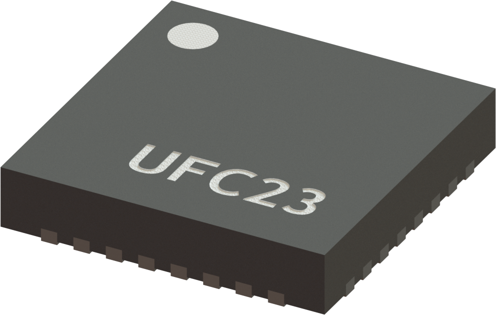
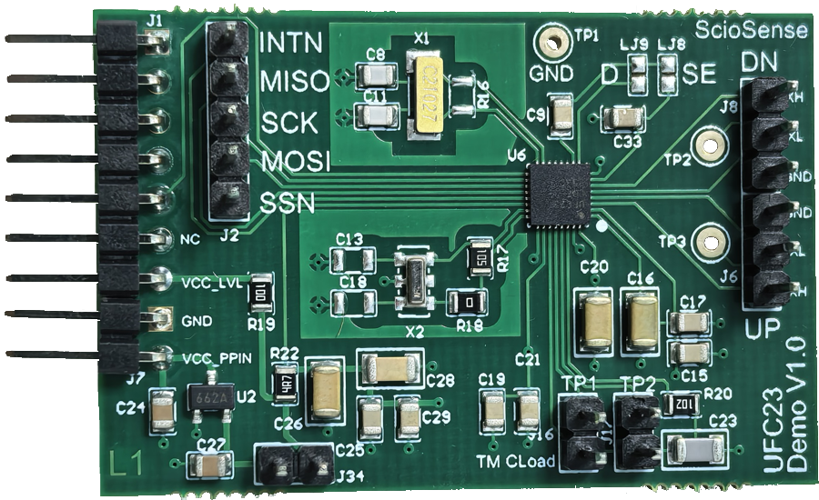
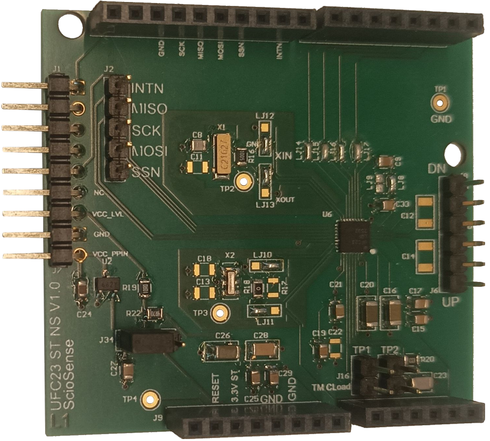
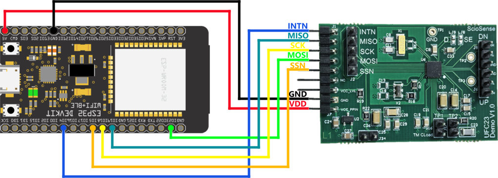

# ScioSense UFC23 Arduino Library
The UFC23 sensor from [ScioSense](https://www.sciosense.com/) offers an ultrasonic flow converter for measurements in water, heat, and gas meters. The sensor comes in the size QFN32 package with a digital SPI interface. It uses a high-performance front-end capable of driving two transducers and processing the received signal to extract the time of flight (TOF) information with high precision and offset stability.

A 128-words RAM allows access to all time data but also accumulation of data (batch mode) and reduced wake-up of external µC. With 1µA quiescent current and low operation current it is optimized for battery-operated systems.

## Prerequisites
It is assumed that
 - The Arduino IDE has been installed.
   If not, refer to "Install the Arduino Desktop IDE" on the
   [Arduino site](https://www.arduino.cc/en/Guide/HomePage).
- The library directory is at its default location. Normally this is `C:\Users\[your_username]\Documents\Arduino\libraries`.

You might need to add your board to the Arduino IDE. This library was tested with the [Espressif ESP32](https://www.espressif.com/en/products/socs/esp32). 
For the installation of the ESP32 in the Arduino IDE, see [Arduino ESP32 Installation](https://docs.espressif.com/projects/arduino-esp32/en/latest/installing.html)

## Installation

### Installation via Arduino Library Manager
- In the Arduino IDE, navigate to the Arduino Library Manager on the left side (or, alternatively, select Sketch > 
Include Library > Manage Libraries...)
- Search for `ScioSense_UFC23`
- Select the library from the search results and press `Install`

### Manual installation
- Download the code from this repository via "Download ZIP".
- In Arduino IDE, select Sketch > Include Library > Add .ZIP library... and browse to the just downloaded ZIP file.
- When the IDE is ready this README.md should be located at `C:\Users\[your_username]\Documents\Arduino\libraries\ScioSense_UFC23\README.md`.

## Wiring

### General

There are two evaluation kit models:
 - Standard kit

 - Arduino pinout kit

Both evaluation boards have the same pinout connections for the ScioSense picoprog and for the ultrasound transducer.

### Power to the sensor

The UFC23 works at 3.3V and the boards have a LDO to be able to work with 5V VCC input. If the LDO is used, the proper jumper must be placed. On the standard kit this means placing the J34 jumper. On the Arduino pinout kit, jumper J32 must be placed bridging the center pin to the left (when using the picoprog connections) or to the right (when using the Arduino connectors).

### Ultrasonic connections
For all examples except **06_Gas** the transducer is connected in single ended mode. That means that the leads of the upstream transducer must be connected to XL_UP and to GNDP, and the leads of the downstream transducer to XL_DN and to GNDP.

For the **06_Gas** example the connection is differential. This requires the leads of the upstream transducer to be connected to XH_UP and XL_UP, and the leads of the downstream transducer to XH_DN and to XL_DN.

### Example with ESP32
This example shows how to wire a [ESP32DevKitC](https://docs.espressif.com/projects/esp-idf/en/latest/esp32/hw-reference/esp32/get-started-devkitc.html#get-started-esp32-devkitc-board-front) 
with the UFC23 breakout board for SPI communication.

| UFC23 evaluation kit  | ESP32 |
|:---------------------:|:-----:|
|          INTN         |  G04  |
|          MISO         |  G19  |
|          SCK          |    |
|          MOSI         |  G23  |
|          SSN          |  G05  |
|          -            |  -    |
|          -            |  -    |
|          GND          |  GND  |
|          VCC          |  5V   |

## Selecting a sensor configuration
The examples adjust the UFC23 configuration by setting the contents of the registers. This is done providing an array with the register contents into the _ufc23.setConfigurationRegisters()_ function. It is also possible to edit the individual parameters under _ufc23.Param_. After modifying the parameters this way, the _ufc23.updateConfiguration()_ function must be called to update the data structures to these new settings.

The configuration is only written to the device when the function _ufc23.writeConfig()_ is called.

### Transducer
The examples contains a configuration that is ready to be used with the [Audiowell ultrasound transducer HS0014-007](https://www.audiowell.com/flowsensorwithpipe/80.html). The configuration must be adapted for your specific transducer.

The following registers must be reviewed in particular:
- CR_USM_PROC (Ultrasonic processing) (Address 0xAA)
  - C_USM_MASK_WIN: Mask window, depends on the the length of the transducer
- CR_USM_FBG_MCTRL (Fire burst generator control) (Address 0xAB)
  - C_FBG_LR_CLK_DIV: Divider to select a fire frequency that coincides with the resonance of the transducer
- CR_USM_ANA_CTRL2 (analog control) (Address 0xAE)
  - C_RMSET_TX: resistance of the transducer
  - C_RMSET_RX: resistance of the transducer
  - C_PGA_ST1_GAIN: gain of first PGA stage. If more amplification is needed consider using differential mode and the second PGA stage
- CR_USM_HIT_CTRL (Ultrasonic hit control) (Address 0xB0)
  - C_TOF_MULTIHIT_NO: Number of hits to fire. The firing of pulses should be completed before the echoes arrive back to the firing transducer
- CR_USM_MASK_HR_WIN (High resolution receiver mask in up direction) (Address 0xB2)
  - C_USM_MASK_HR_WIN_DN: can be used to fine tune the mask window
  - C_USM_MASK_HR_WIN_UP: can be used to fine tune the mask window

## Build an example
To build an example sketch
 - (Re)start Arduino.
 - Open File > Examples > Examples from Custom Libraries > ScioSense_UFC23 > 01_Basic (or any other of the provided 
examples you wish to run)
 - Make sure Tools > Board lists the correct board.
 - Select Sketch > Verify/Compile.

## Contributing
Contributions in the form of issue opening or creating pull requests are very welcome!

### ScioSense is a Joint Venture of ams AG 
