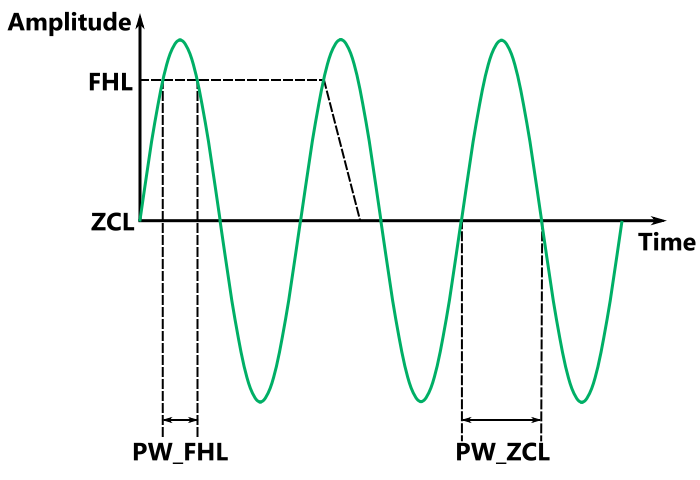
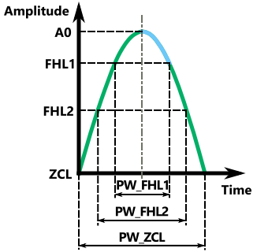

# UFC23 First Hit Level adjustment through Pulse Width Ratio

The UFC23 ultrasonic flow sensor allows the user to adjust the threshold for the First Hit Level. Only after crossing this value will the system start registering the hits by measuring the zero crossings of this signal. Since the amplitude of the pulses can change over time due to changes in the attenuation coefficient of the fluid (due to temperature, composition, etc), it is recommended to adjust this value to retain the correct operation of the sensor.

There are two methods to implement the adjustment of this threshold. The most straightforward is measuring the amplitude of the first hit and ensuring that the threshold stays at a consistent ratio with it. An example for this procedure has already been presented in 09_First_Hit_Adjustment_Amplitude.

The other method is using the Pulse Width Ratio, which will be explained in this README. For the calculations only the First Hit Level Pulse Width will be used (C_USM_PWD_MODE = 2).

## Threshold calculation from Pulse Width Ratio

Once the signal crosses the First Hit Level (FHL), the time that the first pulse is above the FHL will be measured as PW_FHL. Then, the sensor sets the comparator voltage to the Zero Cross Level (ZCL) and measures for a new pulse the time it is above this value as PW_ZCL.

If we center ourselves on the peak A0, we see that from here onwards we can model the signal with a cosine. The next figure represents how different FHL thresholds generate different PW_FHL, and how they would relate to a PW_ZCL.

The amplitude of the signal starting from the peak is given by the function:
$$
y = A_0 cos(\omega t )
$$

For a certain threshold FHL, we will have an associated pulse width

$$
FHL = A_0 cos\left(\omega \frac{PW\_FHL}{2}\right)
$$

Since we know that at PW_ZCL / 2 the amplitude is zero, then the contents of the cosine must be π/2

$$
0 = A_0 cos\left(\omega \frac{PW\_ZCL}{2}\right) \Rightarrow \omega = \frac{\pi}
{2}\left( \frac{1}{\frac{PW\_ZCL}{2}}\right)
$$

So our equation for the first hit level ends up being a function of the Pulse Width Ratio (PW_FHL / PW_ZCL)

$$
FHL = A_0 cos\left(\left( \frac{\pi}
{2}\frac{1}{\frac{PW\_ZCL}{2}}\right) \frac{PW\_FHL}{2}\right)
$$
$$
FHL = A_0 cos\left( \frac{\pi}{2}\frac{PW\_FHL}{PW\_ZCL} \right)
$$
$$
FHL = A_0 cos\left( \frac{\pi}{2}PWR \right)
$$

If using a threshold FHL1 we obtain a PWR1, and we want to obtain a PWR2 instead, the FHL2 can be calculated as:

$$
FHL_2 = FHL_1 \frac{cos\left( \frac{\pi}{2}PWR_2 \right)}{cos\left( \frac{\pi}{2}PWR_1 \right)}
$$

## Implementation

In the example, the cosine of the Pulse Width Ratio is calculated at the start to reduce the computing load. The cosine of the measured Pulse Width Ratio is performed using a taylor approximation to 3 terms to obtain a faster algorithm. Within [0, π/2] the error is below 0.02.

$$
cos(x) \cong 1 - \frac{x^2}{2} + \frac{x^4}{24} + \cdots
$$
